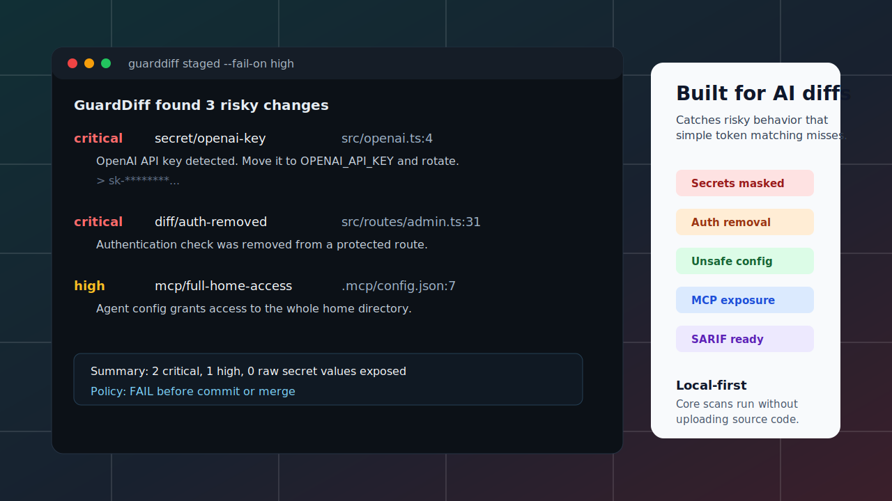
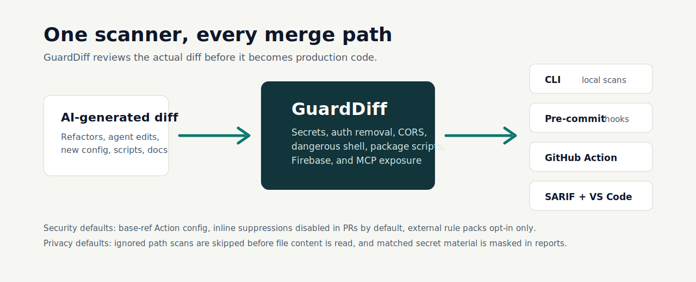

# GuardDiff

GuardDiff is a local-first security gate for AI-generated diffs. It blocks leaked secrets, removed auth, unsafe config, dangerous package scripts, dangerous shell execution, and over-permissive agent access before they merge.

In one minute: install the CLI, scan the diff your AI coding agent produced, and fail fast when a change would leak a secret, weaken authentication, open Firebase/Firestore rules, or grant an agent too much local access. GuardDiff runs locally by default and is designed to fit pre-commit hooks, CI, GitHub Actions, and editor workflows.

[](https://github.com/TKY-27/GuardDiff/actions/workflows/ci.yml)
[](./LICENSE)
[](https://nodejs.org/)



GuardDiff is not just a secret scanner. It reads the diff an AI assistant just produced and blocks the classes of production-breaking changes that usually slip past simple token matching.

Start here: [Quick Start](#quick-start), [Install](#install), [Usage](#usage), [Security](#security), [Local-First Privacy](#local-first-privacy), and [Roadmap](#roadmap).

```bash
npm install -g guarddiff
guarddiff init --github-action --pre-commit
guarddiff staged --fail-on high
```

> `npm install -g guarddiff` is the intended public install command. Before the first npm publish, use the local development commands in [Quick Start](#quick-start).

```text
GuardDiff found 3 risky changes

critical  secret/openai-key      src/openai.ts:4
          OpenAI API key detected. Move it to OPENAI_API_KEY and rotate the exposed key.

critical  diff/auth-removed      src/routes/admin.ts:31
          Authentication check was removed from a protected route.

high      mcp/full-home-access   .mcp/config.json:7
          Agent config grants access to the whole home directory. Scope it to this project.
```

Terminal recording: [docs/assets/guarddiff-demo.cast](./docs/assets/guarddiff-demo.cast)

## Why GuardDiff?

AI coding tools are excellent at large edits, but risky changes often arrive as normal-looking refactors: a guard clause disappears, CORS becomes `*`, a Firebase rule opens reads, or an MCP config grants access to the whole home directory.

Secret scanners catch leaked credentials. GuardDiff is built for the broader "AI changed this diff" problem:

| Risk | Plain secret scanner | GuardDiff |
|---|---:|---:|
| API keys and private keys | yes | yes, masked in reports |
| Auth checks removed during refactors | no | yes |
| CORS `*`, debug endpoints, `eval`, sensitive logs | no | yes |
| Dangerous npm lifecycle scripts | no | yes |
| Firebase/Firestore open rules | no | yes |
| MCP root/home/network/auto-exec exposure | no | yes |
| PR comments, annotations, SARIF, VS Code diagnostics | partial | yes |

What makes it useful in real repositories:

- Secrets and private keys added in source, config, docs, or fixtures.
- Authentication checks removed from routes, middleware, policies, or guards.
- Refactors that move auth checks without deleting them, with false-positive control in `diff/auth-removed`.
- All-open CORS, debug endpoints, `eval`, sensitive logging, unsafe shell execution, and dangerous package lifecycle scripts.
- Open Firebase/Firestore rules and committed `.env` files.
- MCP or agent configs with root, home-directory, unrestricted network, or auto-exec access.
- Security-first CI defaults: the GitHub Action reads trusted base-ref config for PRs, keeps inline suppressions disabled by default, and requires explicit opt-in for executable rule packs.

GuardDiff is local-first by default. The core scanner does not upload code. The GitHub Action only uses GitHub APIs for optional PR comments, workflow annotations, SARIF upload, and rule update notices.



## Quick Start

Requires Node.js 18+.

## Install

Public install after npm publish:

```bash
npm install -g guarddiff
guarddiff staged --fail-on high
```

Local checkout before npm publish:

```bash
npm install
npm run build
node packages/cli/dist/index.js staged --fail-on high
```

## Usage

Common commands:

```bash
guarddiff scan . --format terminal
guarddiff scan src --diff HEAD~1 --format sarif
guarddiff diff --file examples/leaked-api-key/openai.diff
guarddiff diff --stdin
guarddiff rules
guarddiff rules --json
guarddiff benchmark benchmarks/fp-corpus
```

## What It Catches

Built-in rule families:

- `secret/*`: OpenAI, Anthropic, AWS, GitHub, Stripe, Supabase, Firebase config, private keys, and high-entropy secret-like strings.
- `diff/*`: auth bypass/removal, CORS wildcard, debug endpoints, dangerous shell execution, `eval`, and sensitive logs.
- `config/*`: committed `.env`, plaintext env secrets, open Firebase/Firestore rules, and dangerous `package.json` lifecycle scripts.
- `mcp/*`: full-home access, root access, auto-exec without approval, and unrestricted network.

`diff/auth-removed` is intentionally refactor-aware. It downgrades or suppresses refactor-like moves and only escalates when authentication context was actually removed from the change.

See [docs/rules/README.md](./docs/rules/README.md) for rule intent, remediation, suppression examples, and self-scan guidance.

## GitHub Action

Use the root action for pull requests:

```yaml
name: GuardDiff Security Check

on:
  pull_request:
    types: [opened, synchronize, reopened]

jobs:
  guarddiff:
    runs-on: ubuntu-latest
    permissions:
      contents: read
      pull-requests: write
      security-events: write

    steps:
      - uses: actions/checkout@v4
        with:
          fetch-depth: 0

      - name: Run GuardDiff
        uses: TKY-27/GuardDiff@v0.1.0
        with:
          fail-on: high
          post-comment: true
          sarif: true
          annotations: true
          rules-update-check: true
          allow-inline-suppressions: false
          sarif-file: guarddiff-results.sarif
        env:
          GITHUB_TOKEN: ${{ secrets.GITHUB_TOKEN }}

      - name: Upload GuardDiff SARIF
        if: always()
        uses: github/codeql-action/upload-sarif@v3
        with:
          sarif_file: guarddiff-results.sarif
```

The Action supports PR comment upsert, workflow annotations, SARIF output for Code Scanning, and rule update notices from `docs/site/rules/manifest.json`.

For pull requests, the Action loads GuardDiff config and `.guarddiffignore` from the trusted base ref instead of the PR head, so a PR cannot disable the finding it introduces by editing config in the same diff. Inline `guarddiff-ignore` suppressions are disabled by default in the Action; enable `allow-inline-suppressions: true` only when suppressions are reviewed in a trusted branch.

External rule packs are disabled in the GitHub Action by default because they execute code from the checked-out repository. Enable `allow-rule-packs: true` only on trusted branches.

See [integrations/github-action/README.md](./integrations/github-action/README.md) and [docs/action-smoke-test.md](./docs/action-smoke-test.md) for release smoke testing.

## Pre-Commit

Generate local guard files:

```bash
guarddiff init --pre-commit
```

The repository also ships [.pre-commit-hooks.yaml](./.pre-commit-hooks.yaml), so consumers can use GuardDiff from pre-commit.com.

## VS Code

The stable extension in [integrations/vscode](./integrations/vscode) shells out to the GuardDiff CLI, reports diagnostics, exposes a status-bar scan command, and can scan on save with `guarddiff.scanOnSave`.

## Rules And Suppression

Inline suppressions are for reviewed one-off examples:

```ts
const token = "documented-placeholder"; // guarddiff-ignore: secret/high-entropy
```

Use `.guarddiffignore` for generated files, fixture directories, and intentionally insecure examples:

```gitignore
examples/**
docs/examples/**
**/fixtures/**
**/__fixtures__/**
dist/**
coverage/**
```

External rule packs load from the scanned workspace:

```yaml
version: "1"
policy:
  failOn: high
rules:
  packs:
    - "@guarddiff-community/rules-terraform"
```

Executable rule packs are disabled by default in both the CLI and GitHub Action. On trusted local repositories, opt in explicitly:

```bash
guarddiff scan . --allow-rule-packs
guarddiff rules --allow-rule-packs --json
```

Run `guarddiff benchmark benchmarks/fp-corpus` before detector changes to catch false-positive regressions.

See [docs/rule-packs.md](./docs/rule-packs.md) for the community rule-pack contract.

## Local-First Privacy

- Core scanning runs locally and does not upload source code.
- Terminal, JSON, Markdown, and SARIF reporters mask matched secret material.
- GitHub PR comments and annotations report rule IDs, paths, locations, and remediation without raw secret values.
- Path scans skip `.guarddiffignore` and configured ignored paths before reading file contents.
- The VS Code extension does not execute scans in untrusted workspaces and rejects workspace paths that escape the opened folder.
- Keep real vulnerabilities, real credentials, and exploitable bypasses out of public issues. Use GitHub Security Advisories as described in [SECURITY.md](./SECURITY.md).

## Repository Layout

```text
packages/core              parser, rules, engine, reporters
packages/cli               command-line entrypoint and git/filesystem adapters
integrations/github-action GitHub Action implementation
integrations/pre-commit    pre-commit hook assets
integrations/vscode        VS Code extension
benchmarks                 false-positive regression corpus
examples                   intentionally insecure and safe fixtures
docs                       user docs, rule docs, release checks, static site
```

## Docs

- [Getting started](./docs/getting-started.md)
- [Rules](./docs/rules/README.md)
- [Rule packs](./docs/rule-packs.md)
- [GitHub Action smoke test](./docs/action-smoke-test.md)
- [Release checklist](./docs/release-checklist.md)

## Roadmap

Near-term work is tracked in [ROADMAP.md](./ROADMAP.md). Current priorities are tighter false-positive benchmarks, more framework-specific auth patterns, richer VS Code workflows, and safer community rule-pack distribution.

## Contributing

Contributions are welcome when they keep the scanner local-first, add true-positive and false-positive coverage for detector changes, and update [CHANGELOG.md](./CHANGELOG.md). Start with [CONTRIBUTING.md](./CONTRIBUTING.md).

## Security

Do not post real secrets, private code, or exploitable bypass details in public issues. Report security-sensitive findings through GitHub Security Advisories. See [SECURITY.md](./SECURITY.md).

## License

MIT. See [LICENSE](./LICENSE).
